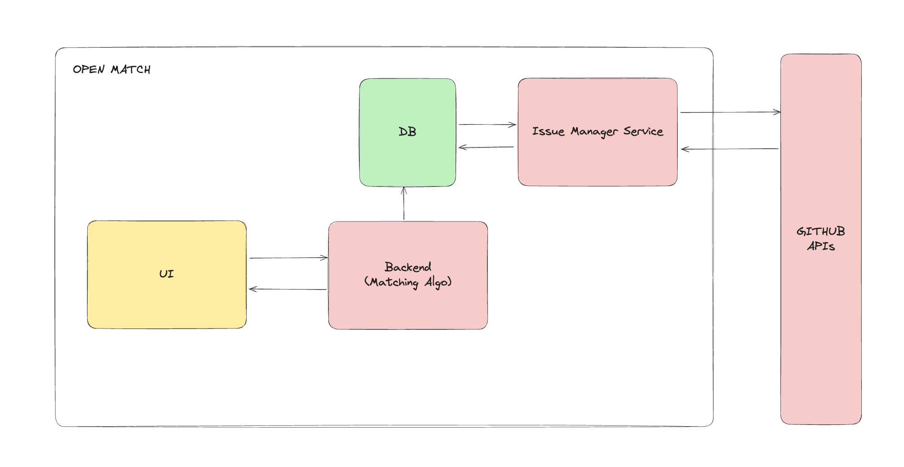

# OPEN MATCH

## Inspiration

Contributing to open source is an incredible way to grow as a developer, enhance your skills, and make a positive impact on the tech community. However, for many of us, especially first-timers, the journey can feel daunting. With countless projects and issues to sift through, it’s often overwhelming to find the right fit. Despite the availability of platforms that list open issues, there remains a steep learning curve to navigate complex codebases and identify tasks that align with one's expertise.

That's where Open-Match comes in. Our mission is to empower developers to make impactful open-source contributions by simplifying this process. By allowing users to upload their profiles, we are trying to match them with open issues that align with their existing skills or interests. We aim to reduce the friction of that first contribution, helping developers discover where their talents can truly make a difference. Open-Match is here to bridge the gap between developers and the open-source projects that need their unique skills, making it easier for everyone to get started and grow in the world of open-source.

## 🛠️ How We Built Open-Match
Open-Match is built with a focus on delivering a seamless experience for developers looking to make impactful open-source contributions. Here's an overview of how we developed the project:

### Frontend
The frontend offers developers two seamless ways to engage with open-source projects. Users can either search for issues and projects using advanced filters or leverage a personalized matching feature. By uploading their resumes, social media profiles, and other relevant information, users provide insights into their skills, experience, and interests. This data is analyzed to deliver tailored recommendations, connecting developers with open-source issues and projects that align with their expertise and passions.

### Backend & Data Processing
Our backend is powered by a robust service that indexes open GitHub issues and projects. Initially, we aimed to cover all open-source projects, but we pivoted to focus exclusively on maintainers who are actively seeking contributors and are interested in mentoring. To facilitate this, we introduced the [Open-Match GitHub Bot](https://github.com/apps/open-match-bot), a seamless tool for maintainers and repository owners.

By installing the bot, maintainers subscribe their repositories to our platform. The bot integrates with GitHub APIs to continuously monitor and update our database with new projects, open issues, and relevant changes. This ensures our data is always fresh and aligned with the latest contributions.

To enhance the usability of this data, we leverage Large Language Models (LLMs) to generate concise and comprehensive summaries for each issue. These summaries provide valuable context and clearly outline requirements, making it significantly easier for potential contributors to engage effectively.

### Matching Engine
Our matching engine, powered by MongoDB Atlas and LLMs, uses semantic embeddings to connect developers with the most relevant GitHub issues. By analyzing both developer profiles and issue details, it ensures precise matches based on skills and experience, going beyond basic keyword searches to identify opportunities where contributions have the greatest impact.

### Bringing It All Together
Open-Match streamlines the open-source journey by helping developers find projects that align with their expertise and interests. Whether you're a seasoned contributor or just starting out, Open-Match makes it easy to discover meaningful opportunities and start contributing effectively.

### Interested in Contributing
We’re thrilled to have you contribute to Open-Match! Whether you’re an experienced developer or just getting started, your support is invaluable. Here’s how you can get involved:  

1. **Fork the Repository**: Clone the project and explore the codebase.  
2. **Find an Issue**: Check the **Issues** tab for tasks or share your ideas by opening a new issue.   
3. **Submit a Pull Request**: Once your changes are ready, create a pull request for review.  

We’re happy to discuss ideas, guide you through the contribution process, or answer any questions you may have. Join the conversation in our **[GitHub Discussions](https://github.com/sbangariGIT/open-match/discussions)**!
